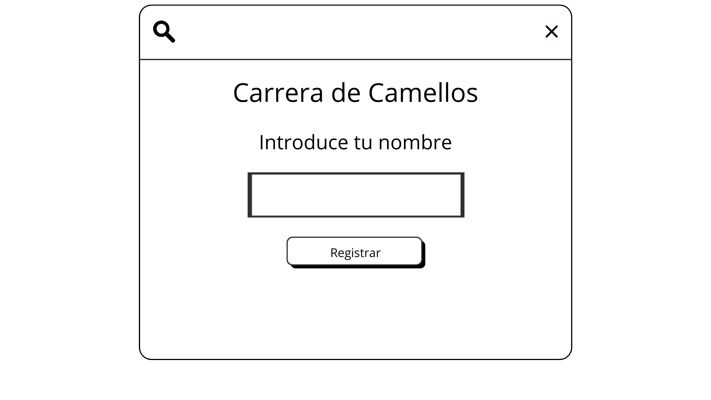

#  REQUISITOS FUNCIONALES 
- **Registro de los jugadores**
- **Asignacion de camellos a jugadores**
- **Movimiento de los camellos** 
- **Determinar el ganador de la carrera**
- **Crear certificado del ganador** 
- **Jugar desde ordenadores distinos**
- **Crear la interfaz grafica del usuario**
- **Guardar recuento de partidas y resultados**

# PROTOTIPO
## INTERFAZ INICIO

## Objetivo del Juego

**El objetivo de esta aplicación es permitir que dos jugadores compitan en una carrera automática de camellos. Cada jugador se registra con su nombre, y el sistema simula la carrera entre los camellos asignados a cada uno. El primero en llegar a la meta es el ganador. Si un jugador gana, se genera un certificado en PDF con su nombre. Además, se lleva un registro de partidas y resultados.**

## Flujo general del Juego

**1. Los jugadores introducen su nombre para registrarse.**
**2. El sistema asigna automáticamente un camello a cada jugador.**
**3. Se inicia la carrera de forma automática.**
**4. Los camellos avanzan de forma aleatoria hasta alcanzar la meta.**
**5. El sistema determina cuál camello llega primero.**
**6. Se muestra el resultado: quién ganó y quién perdió.**
**7. El jugador que gana puede generar y descargar un certificado en PDF.**
**8. El sistema guarda los resultados de la partida en un historial.**

## Lógica del juego

**- El movimiento de los camellos es controlado por el sistema, sin intervención de los jugadores.**
**- Cada camello avanza de forma aleatoria en intervalos de tiempo regulares.**
**- Se comprueba continuamente si algún camello ha alcanzado la meta.**
**- El primer camello que cruce la meta es declarado ganador.**
**- El sistema bloquea el avance al detectar un ganador y muestra el resultado.**
